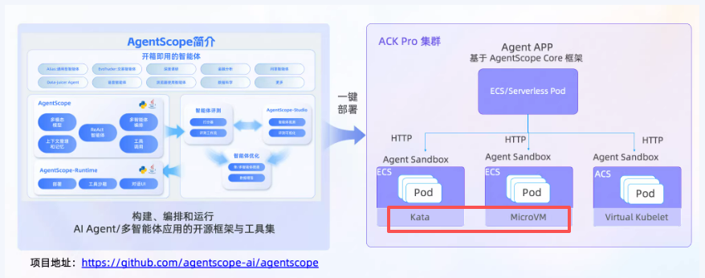

# L3 虚拟化层：虚拟化，容器

## 核心内容
<!-- 在此处添加内容 -->

---

## 容器

### OpenClaw沙箱技术
    Openclaw当前仍是最火的AI应用，当前各大企业也在跟进扩展相应的2B2C业务，想要把一个开源免费的产品，打包成付费的产品卖出去，信息差是避免不了的。当然我们也承认Openclaw因为发展的过快（几个月完成Linux 30年的关注度，能不快么），自身必然存在着一些安全问题，解决Openclaw的安全问题，自然成为企业级Openclaw解决方案的重要一环。 不同的厂商因为有其自身的“屁股”，所以整个解决方案会特别繁杂，举例来说，360就会推荐它的软件扫描，防火墙厂商就会有其引申的硬件防护方案。 总之，沿着我在 大纲，这一页的 架构分层来看，除了基础设施土建，从L1的存算网，一直向上延伸到Agent，也就是代码本身，都可以推出其安全解决方案，我今天只着重讲其中一层， 虚拟化层。

    其实本来不想去写的，这周沉醉于 《33号远征队》，但是近期参加的几次会议，实在让人失望，因为作为一个高级别的技术专家，连基本的概念都没理清，靠着 Deepseek之类的大模型，输出一个材料，就敢信口开河的乱讲，根本没有去 纵向看一下Openclaw的源代码，也没有横向对比一下友商的方案，讲了错误的概念，反而误导了大众。

    我要说的 ，就是这个Openclaw的沙箱技术

#### 误解是怎样发生的？

    --Rule 能确认信息可靠性的一定要去确认信息的可靠性 --Rule
    --Rule 任何讨论，都要搞清楚当前讨论的东西，具体是什么，不要只聊抽象的概念 --Rule
    1 Openclaw认为的沙箱是什么
    问题是这样发生的，在Openclaw中，agent每起一个子任务，或者Agent调用MCP协议后的Tools时，也就是执行具体的操作时，按照Openclaw的规范，需要起一个沙箱 或者说 “Sandbox” 作为代码承载的环境。 那其实接下来的问题就简答了，这个沙箱是什么，精确点说，对于Openclaw来说，这个沙箱是什么？ 继续检查源代码，我们会发现，其实这个沙箱就是一个打包好的容器，因为代码指向了一个容器镜像 “ Openclaw-sandbox：bookworm-slim” ，容器本身会存在一些安全加固的方式，同时Openclaw也会通过配置项的方式，来决定当前沙箱处于什么模式，进而限定其权限。

    2 过去业界讨论的沙箱是什么
    通常来说，当我们提起沙箱，想到的是一个抽象的概念，这是一个安全的解决方案，就是对于一些恶意的代码或者指令，软件扫描有可能查不出来问题，但是如果能让他执行一下，就知道这个代码会产生什么效果了，把这个代码放到一个完全隔离的环境里，让其执行，如果没有问题，就把他放出来，这就是沙箱 。 这个抽象的概念必须找一个东西来落实，硬件服务器自然可以，但是读者会发现，这个沙箱 创建的快，删除的也快，因为执行结束后完全没有存在的必要，那么虚拟化就是一个好的承载手段，自然就想到了虚拟机，和容器，这两种方式。 如果是容器的话，自然就和Openclaw的定义一致了。

    3 当时分享的问题出在哪里？

    --Rule 一定不要迷信专家，在大模型的时代，他未必比你走的多远，因为一切都变得太快了 --Rule
    在当时分享的会上，提到了底层隔离技术，专家的分类是  容器  沙箱  容器+沙箱。 看到这三个分类 ，后面的就不用看了，因为对方把不是一个层级的概念放到了同一对比维度进行分析， 这里的沙箱就是容器，那又何必分成两类分析？ 最后的  容器+沙箱 更是欲盖弥彰，不知道是哪个倒霉的大模型给出来的方案，提到了一个  Docker in Docker的概念，还煞有介事的给出了一个缩写 DID ，吓得我虎躯一阵，还专门学了学这个高大上的概念。

    专家的解释是 Docker in Docker 因为是堆叠的两层，所以更安全。
    TMD ，我都无语了，动脑子想一想，用两个完全一样的锁，锁两个俄罗斯套娃，难道就更安全了？ 能打开外层的盒子 ，就能打开内部的盒子 ！ 
    装懂对自己没好处。

    专家很无奈，说 ，今天咱们不讨论技术，聚焦客户的使用场景。。。。  学会了么 兄弟们，以后技术面被挑战了 ，就用出这个经典话术，

    --话术 当技术问题回答不上时，就说 “今天我们不讨论技术，先聚焦用户使用场景” -- 话术

    4 业界的方案是什么样的
    前面是对一个产品的纵向分析，接下来要横向看其他大厂的方案了，我们就简单看下腾讯，阿里，字节的方案。 登录他们的云网站，搜索沙箱，给你弹出来的基本就是Agent沙箱，赶一下Openclaw的风口。
    腾讯Agent沙箱 ： 隔离方式是VM级别的，或者说安全等级是虚拟机级别的，实际使用的是容器。这个是讲的最细的了
    阿里：这个是我最想说的，其实阿里的容器方案很安全，但是在营销上没重点提及，其实腾讯的营销文档说的也不太直接，比较绕。观察下图，我们发现，kata 和Micro VM这两个产品，但是官网是没有文字解释的，大家先理解成是一个安全容器，在下个章节会展开。
 

    字节 ： 容器

    其实从几个厂商的官网，能看到对外部的营销话术，腾讯有意在强调自己的安全水平是虚拟机级别的，至少在着重强调安全这个概念，虽然对我的理解造成了困扰，因为我当时没搞清楚，为啥同样都是沙箱agent，前面说是基于虚拟化技术搞得，后面又说是基于容器产品搞得。最后梳理了一下，觉得应该是用的 硬件虚拟化技术做安全隔离。 阿里干脆就没在官网谈安全，虽然使用的是安全容器，还是理工气息比较浓重。

    5 虚拟机和容器的安全层级

    首先我们先把结论抛出来，腾讯提的 虚拟化级别的安全沙箱，是 Docker in VM ，就是虚拟机上安装了容器，这解决了容器的安全问题，退一步讲，这个故事比 DID ，还记得这个DID么，容器上装容器  这个逻辑更通顺 ，因为想要突破这个安全体系，至少要用两把钥匙，一把开容器，一把开虚拟化。 
    看到这里，读者会发现，我们默认 容器是不安全的，分析这个问题，又要回到虚拟机个容器的核心区别。

    - 容器：是在虚拟机技术之后发明的，要解决的问题是快！ 快速部署！任何东西都有代价，安全是其中之一。 容器通过进程级隔离（共享主机内核），通过命名空间、控制组等技术实现。可以简单的理解成是一个进程。
    - 虚拟机： 或者说虚拟化技术，全程是 硬件虚拟化，隔离级别不是进程级，而是硬件级，所以安全性会更高。可以理解成 虚拟化的核心模块，KVM是对接了硬件提供的虚拟化能力，比如 CPU提供了CPU虚拟化能力，KVM进行管理，这样安全性更高。但是因为其运行完整的操作系统，启动速度慢，后来大家提出了敏捷开发的概念，加上弹性负载均衡的概念，要快速的发放删除，容器自然响应了这个趋势。

    容器的提供商看到肯定想骂人。 照你这么说，我们容器不用干了，反正也不安全，用了容器就会逃逸，会干扰其他容器，整个系统崩盘。 肯定不是这样，容器厂商自己也发现了这个问题，就提出了 安全容器的概念，比如 阿里截图中提到的kata ，micro VM这样的容器，从技术栈上来看，是在容器和虚拟化间做了个平衡，安全等级是硬件级别的，但是更轻量，启动速度更快。  举例 ：每个Kata容器（或Pod）都运行在一个独立的微型虚拟机中，拥有自己独占的Guest内核，并通过CPU的硬件虚拟化扩展（如Intel VT-x）实现强隔离。这与传统VM的隔离级别相同，远高于普通容器（共享主机内核）。 代价，肯定是慢啊，至少比进程级的容器要慢。

#### 总结
    本文从一个技术分享的会议展开讨论，主要聚焦了Openclaw虚拟化层的安全问题及对应各厂商的解决方案。 同时引出几个观点，一定要深入到产品中去确认信息的可靠性，不要盲目相信专家，大模型时代变化很快，你先研究，你就是专家。 
    结构化文档全集参阅 ：https://github.com/NoahHao/Be_a_AI_PLM
## 待补充
- [ ] 虚拟化技术
- [ ] 容器技术
- [ ] 虚拟化架构
